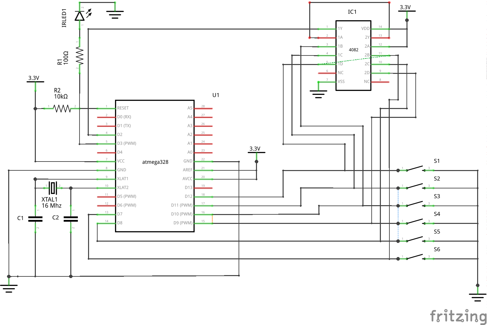

arduino-apple-remote
========================

A low power arduino sketch to imitate an apple remote.

A big thanks to Shirriff for his breakdown of atmegea328 PWM
and his [Arduino-IRremote](https://github.com/shirriff/Arduino-IRremote) remote.
My IR code is essentially a stripped down version of his, with a few minor modifications.

## Setup Instructions

1. Burn the bootloader for the "Arduino Uno with 1.8V BOD" (if running at ~3 V from batteries)
2. Upload sketch to MCU
3. Construct hardware as shown in schematic

If you have another atmega328, you can use the [ArduinoISP](http://arduino.cc/en/Tutorial/ArduinoISP)
sketch to burn the bootloader without a separate programmer.

## Hardware

The setup is based on an atmega328 MCU.  
An IR LED is connected to arduino pin 3.  
There are 6 buttons (missing the play/pause button introduced in the newer remotes) connected
to arduino pins 7 through 12.
The internal atmega328 pullup resistors are used for the button signals.  
To wake the MCU up from the POWER_DOWN sleep mode, I use an external interrupt.
The interrupt signal is all of the button signals ANDed together using a 4082 IC.

## Brown Out Detection (BOD)

I'm running the MCU on a 3V coin cell battery and by default the arduino bootloader sets fuse
bits to have a 2.7 V limit. Because of this, I ran into brown out issues as the battery discharged.
To combat this, I made a custom entry in my boards.txt file with the fuse bits for a 1.8 V BOD limit.

## Power Saving

There are a few components on the arduino uno board which inevitably draw a fair bit of current.
Because of this, I moved my design to a minimal atmega328 circuit powered by batteries with _no_
voltage regulator. Further power saving was gained by disabling I2C, SPI, ADC, and USART0 via the 
power reduction register (PRR) in the setup function. Also you can disable BOD during sleep using the
`sleep_bod_disable()` function. Here are a few measurements I took along the way...

Description | Sleep | Active
-----------|---------|--------
Arduino Uno (5V) | 26.2 mA | 43.0 mA
Atmega328 (5V) | 0.29 mA | 12.55 mA
/wo I2C, SPI, ADC, and USART0 | 17 uA | 6.5 mA
with BOD disabled during sleep | 0.1 uA | 6.5 mA
